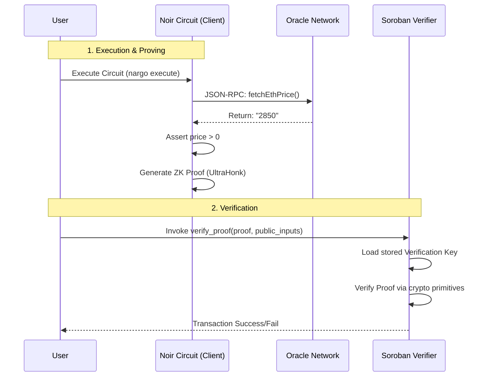

# Stellar ZK Oracle Project

This project simulates a full Zero-Knowledge (ZK) Oracle Validium architecture on Stellar. It orchestrates a Noir circuit (client-side proving), an Oracle Server (data provider), and a Soroban Smart Contract (verify execution).

## Architecture Flow

The system proves that a user has fetched the *correct* data from an authorized oracle without needing to reveal all inputs or trust the user blindly.



## Project Components

### 1-noir-circuit/ (Client)
*   **Tech**: Noir Language, Nargo
*   **Role**: Defines the logic "I checked the price and it was X". It generates the Proof.
*   **Key File**: `eth_price_circuit/src/main.nr`
*   **Commands**:
    *   `nargo check`: Validate code.
    *   `nargo test --oracle-resolver <URL>`: Run tests against a live oracle.
    *   `bb prove`: Generate UltraHonk proofs (requires Barretenberg).

### 2-oracle-server/ (Data Provider)
*   **Tech**: TypeScript, Express, Netlify Functions
*   **Role**: Acts as the "Foreign Call" handler for Noir. Nargo asks "What is `fetchEthPrice`?" and this server responds.
*   **Key File**: `src/api/index.ts`
*   **Endpoints**:
    *   POST `/`: JSON-RPC 2.0 endpoint handling `resolve_foreign_call`.

### 3-soroban-verifier/ (On-Chain)
*   **Tech**: Rust, Soroban SDK
*   **Role**: A smart contract that verifies validity of the ZK proof submitted by the user.
*   **Key File**: `src/lib.rs`
*   **Features**:
    *   `__constructor(vk)`: Stores the Verification Key once at deploy time.
    *   `verify_proof(proof, public_inputs)`: Rejects invalid proofs or inputs.

## Prerequisites

1.  **Rust Toolchain**: `rustup target add wasm32-unknown-unknown` (or `wasm32v1-none`).
2.  **Noir (Nargo)**: [Install Guide](https://noir-lang.org/docs/getting_started/installation/).
3.  **Barretenberg (bb)**: Required for UltraHonk proof generation.
4.  **Stellar CLI**: `cargo install --locked stellar-cli` (optional but recommended).
5.  **Node.js**: v18+ for the oracle server.

## Comprehensive Setup & Usage Guide

### Step 1: Start the Oracle
You need a running oracle for the circuit to fetch data from.

**Option A: Use Live Demo**
*   URL: `https://starlit-bubblegum-c0e20b.netlify.app`

**Option B: Run Local**
```bash
cd 2-oracle-server
npm install
npm run dev
# Running on http://localhost:5555
```

### Step 2: Compile & Test Circuit
Validate the logic off-chain before building proofs.

```bash
cd 1-noir-circuit/eth_price_circuit

# Test against the live oracle
./test.sh
```

### Step 3: Build Soroban Verifier
Compile the contract to WASM.

```bash
cd 3-soroban-verifier
cargo test  # Run unit tests (downloads dependencies first)
cargo build --release --target wasm32-unknown-unknown
```

**Common Issue**: If `cargo test` hangs on "Blocking waiting for file lock", it means it is downloading the large Soroban SDK. **Wait for it to finish** (can take 5-10 mins on first run). Do not interrupt it.

### Step 4: End-to-End Workflow (Manual)

To simulate a full deployment:

1.  **Generate Verification Key (VK)** using `bb`.
    ```bash
    cd 1-noir-circuit/eth_price_circuit
    nargo execute # generates witness
    bb write_vk -b ./target/eth_price_circuit.json -o ./target/vk --scheme ultra_honk
    ```
2.  **Deploy Contract** to Stellar Localnet, passing `vk` to the constructor.
3.  **Generate Proof**:
    ```bash
    bb prove -b ./target/eth_price_circuit.json -w ./target/eth_price_circuit.gz -o ./target/proof --scheme ultra_honk
    ```
4.  **Invoke Contract**: Send the proof bits to the deployed contract.

## Troubleshooting

*   **Nargo execute fails**: `nargo execute` does not support external oracles out-of-the-box. Use `nargo test` with a resolver, or mock the value in `main.nr` temporarily (see circuit README).
*   **Cargo lock stuck**: If you interrupted a download, run `rm -f ~/.cargo/.package-cache` (WSL/Linux) to clear the lock.
*   **Wrong Architecture**: Ensure `target/wasm32-unknown-unknown/release` exists after building.
