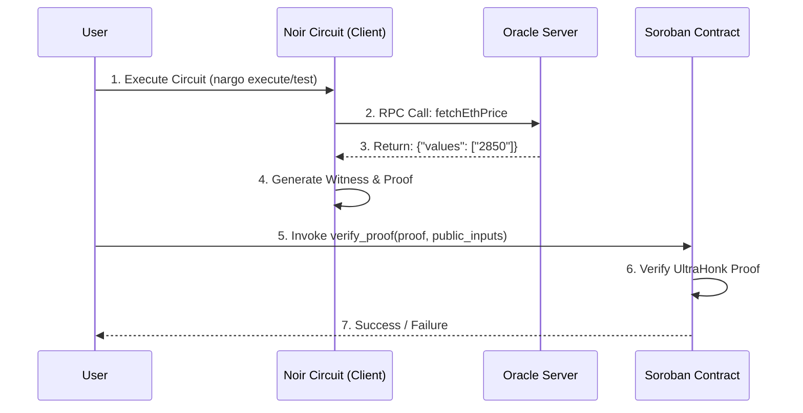

# Stellar ZK Oracle Project

This project demonstrates a Zero-Knowledge (ZK) Oracle architecture on Stellar. It uses Noir for circuit definition and proof generation, an external Oracle Server to provide off-chain training/execution data, and a Soroban Smart Contract to verify the proofs on-chain.

## Architecture

The system consists of three main components interacting to prove off-chain data validity without revealing the entire execution trace or trusting the data provider implicitly on-chain (the verification logic is baked into the ZK circuit).



## Project Structure

### 1. Noir Circuit (1-noir-circuit)
Contains the ZK circuit logic written in Noir.
- **Location**: `1-noir-circuit/eth_price_circuit`
- **Function**: Fetches ETH price from the oracle and asserts constraints (e.g., price > 0).
- **Key Commands**: `nargo check`, `nargo test`, `nargo prove`.

### 2. Oracle Server (2-oracle-server)
A lightweight JSON-RPC 2.0 server acting as the data source.
- **Location**: `2-oracle-server`
- **Stack**: TypeScript, Express, Netlify Functions.
- **Function**: Responds to `fetchEthPrice` method calls from Noir.

### 3. Soroban Verifier (3-soroban-verifier)
A Stellar Smart Contract capable of verifying UltraHonk proofs.
- **Location**: `3-soroban-verifier`
- **Stack**: Rust, Soroban SDK.
- **Function**: Stores verification key and verifies submitted proofs.

## Prerequisites

- **Rust**: Stable toolchain.
- **Nargo**: Noir build tool.
- **Stellar CLI**: For interacting with the Soroban network.
- **Node.js**: For running the oracle server.

## Getting Started

### 1. Start the Oracle Server
You can use the live deployment or run locally.

```bash
cd 2-oracle-server
npm install
npm run dev
# Server listening on http://localhost:5555
```

### 2. Compile and Test Circuit
Use the oracle resolver to execute the circuit.

```bash
cd 1-noir-circuit/eth_price_circuit
# Run test with live oracle
./test.sh
# Or with local oracle
nargo test --oracle-resolver http://localhost:5555
```

### 3. Build Verifier Contract
Compile the Soroban contract to WASM.

```bash
cd 3-soroban-verifier
cargo build --target wasm32-unknown-unknown --release
```
