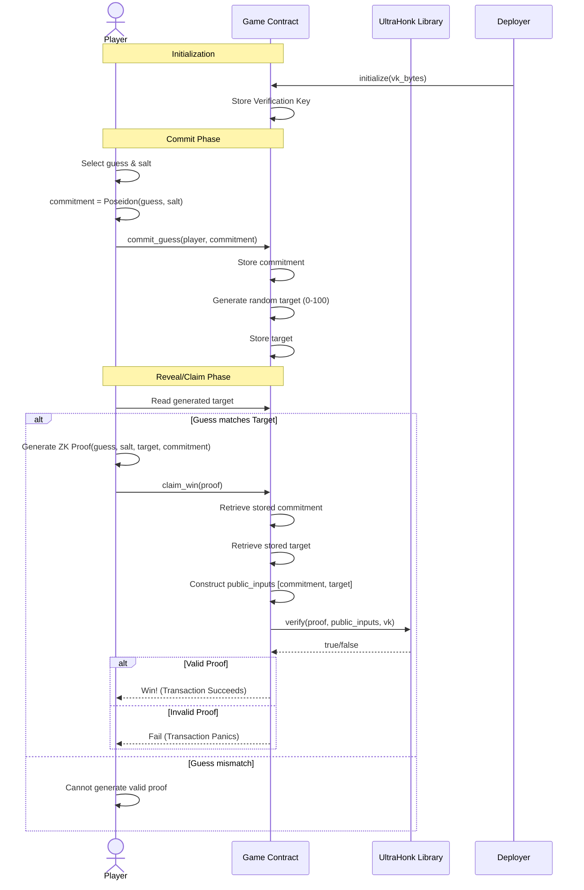

# Setting up the project

Create a folder where you want to store the contracts and also circuit and run the following command. which will generate a contracts folder with the following file structure. 

```bash
stellar contract init contracts
```

## Project Structure

This repository uses the recommended structure for a Soroban project:

```text
├── contracts
│   └── hello_world
│       ├── src
│       │   ├── lib.rs
│       │   └── test.rs
│       ├── Cargo.toml
│       └── Makefile
├── .gitignore
├── Cargo.toml
└── README.md

```

## Creating the ZK Circuits

To generate the ZK logic circuit, ensure you are using `wsl` (Windows Subsystem for Linux) if on Windows. Inside your project folder, run:

```bash
nargo new circuits
```

This will generate a Noir project with the following structure:

```text
.
├── circuits
│   ├─ src
│   │   └──main.nr
│   └── Nargo.toml
```

### 1. Configure Dependencies

Open `circuits/Nargo.toml` and add the Poseidon hasher dependency under `[dependencies]`. This is required for the hashing functions used in the circuit.

```toml
[dependencies]
poseidon = { tag = "v0.2.0", git = "https://github.com/noir-lang/poseidon" }
```

### 2. Implement Circuit Logic

Open `circuits/src/main.nr` and replace its content with the following code. Note that we use `Poseidon2::hash` from the dependency we added.

```rust
use poseidon::poseidon2::Poseidon2; // Efficient hashing for ZK

fn main(
    commitment: pub Field, // Public: The hash of your guess + salt
    guess: Field,          // Private: Your actual secret guess
    salt: Field,           // Private: Random salt to prevent brute force
    target: pub Field      // Public: The number to match
) {
    // 1. Verify the commitment matches the private guess + salt
    let hash = Poseidon2::hash([guess, salt], 2);
    assert(hash == commitment);

    // 2. Verify the guess matches the winning target
    assert(guess == target);
}
```

### 3. Compile the Circuit

Run the following commands to compile the circuit and verify everything is correct:

```bash
cd circuits
nargo compile
```

This will generate a `target/circuits.json` file. You will need the **Verification Key** from this step to initialize the smart contract.

## Deployment & Integration

This project compiles valid Noir Zero-Knowledge proofs verification directly into the game contract.

### 1. Build the Game Contract

```bash
cd contracts
stellar contract build
```

### 2. Deploy the Game

```bash
# Save the returned game_contract_id
stellar contract deploy \
  --wasm target/wasm32-unknown-unknown/release/guess_game.wasm \
  --source sban \
  --network testnet
```

### 3. Initialize the Game

Initialize the contract with the Verification Key (VK) from your Noir circuit.

```bash
# Get the VK from circuits/target/guess_game_circuit.json (use jq or copy manually)
# Example VK (hex): 00010203...

stellar contract invoke \
  --id <game_contract_id> \
  --source sban \
  --network testnet \
  -- \
  initialize \
  --vk <YOUR_VK_BYTES_HEX>
```

## Gameplay

### Game Flow



### 1. Generate Proof

First, generate your proof using Nargo. You will need your secret `guess`, `salt`, and the public `target`.

```bash
cd circuits
# Create Prover.toml with your inputs
nargo execute witness
nargo prove
# This generates proof in outputs/
```

### 2. Submit Claim

Submit your proof to the smart contract to claim your win.

```bash
stellar contract invoke \
  --id <game_contract_id> \
  --source sban \
  --network testnet \
  -- \
  claim_win \
  --player <player_address> \
  --proof <proof_bytes_hex>
```

## Development

To run the integration tests:

```bash
cd contracts
cargo test
```
    Player sends their commitment hash.
    ```bash
    stellar contract invoke \
      --id guess_game \
      --source-account alice \
      --network testnet \
      -- \
      commit_guess \
      --player alice \
      --hash <YOUR_COMMITMENT_HASH_HEX>
    ```

2.  **Generate Proof**:
    Use `nargo prove` (in WSL) to generate your proof string.

3.  **Claim Phase**:
    Submit the proof to win.
    ```bash
    stellar contract invoke \
      --id guess_game \
      --source-account alice \
      --network testnet \
      -- \
      claim_win \
      --player alice \
      --proof <YOUR_PROOF_BYTES_HEX>
    ```

## Ultrahonk Verifier Integration

We have updated the contract to use the `ultrahonk_rust_verifier` as an embedded library rather than an external contract call. This simplifies deployment and verification.

### Key Changes

1.  **Dependency Configuration**:
    *   Added `ultrahonk_rust_verifier` as a git dependency.
    *   **Crucial Fix**: Applied a `[patch.crates-io]` in `Cargo.toml` to force the use of `soroban-sdk` version `25.1.0`. This aligns the version used by our local workspace with the version required by the `ultrahonk` git dependency, resolving "dependency hell" compilation errors.

2.  **Contract Logic (`lib.rs`)**:
    *   The `initialize` function now accepts the **Verification Key (VK)** as `Bytes` instead of an `Address`.
    *   The `claim_win` function now uses `ultrahonk_verifier::UltraHonkVerifier` directly to verify proofs in-process.

3.  **Testing (`test.rs`)**:
    *   Tests were updated to inject a dummy VK (Bytes) instead of deploying a mock verifier contract.
    *   New test cases verify that the contract handles initialization and valid/invalid proof structures correctly using the library.

### How to Build & Test

```bash
# location: guess-game/contracts
cargo test --workspace
stellar contract build
```

## Active Testnet Deployment

**Contract Address (Testnet):** [CBA4NR7GUSW36EKS4Y4XSWEI2LSLBBLJKCI3RZSYYQPKZFVCNVNQTSFD](https://stellar.expert/explorer/testnet/contract/CBA4NR7GUSW36EKS4Y4XSWEI2LSLBBLJKCI3RZSYYQPKZFVCNVNQTSFD) (Feb 10, 2026)

### Important Considerations

1.  **CLI Argument Parsing**:
    *   The `stellar-cli` is strict about parsing specific types like `BytesN<32>`.
    *   **Known Issue**: Invoking `commit_guess` directly from the CLI using a hex string for the `hash` argument often fails with parsing errors.
    *   **Solution**: Use a client SDK (JavaScript/Python) or a test script where types like `ScVal` can be constructed explicitly, rather than relying on the CLI's string-to-type inference for fixed-width byte arrays.

2.  **Verification Key (VK)**:
    *   The contract must be initialized immediately after deployment with the VK generated by `nargo compile`.
    *   If you redeploy the circuit, the VK changes, and a new contract instance (or updated initialization) is required.

3.  **Proof Size**:
    *   UltraHonk proofs are large. Ensure your transaction resource limits (CPU/Mem) are sufficient when calling `claim_win`. The current implementation runs verification on-chain, which is computationally expensive.

